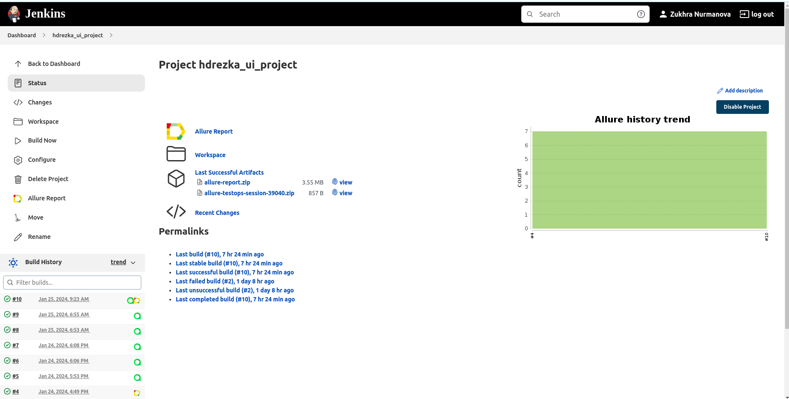

<h1> Проект по тестированию сайта HDRezka.ag</h1>

> <a target="_blank" href="https://hdrezka.ag/">Ссылка на сайт</a>

### Список проверок:
* Проверка переключения темной темы сайта
* Проверка перехода на страницу анонсы
* Регистрация под существующей учетной записью
* Авторизация на сайте (позитивный и негативный кейсы)
* Поиск фильма по названию (позитивный и негативный кейсы)

### Особенности проекта:
* Проверки проводятся для неавторизованного пользователя
* В телеграм приходят оповещения о результатах прохождения тестов
* Сборка проекта осуществляется через Jenkins 
* Отчеты в Allure Report
----

### Используемый стэк

      

----

### Проект в Jenkins
> <a target="_blank" href="https://github.com/ZukhraN/hdrezka_ui_project">Ссылка на проект в Jenkins</a>

Наш проект возможно запускать через Jenkins. Доступны следующие параметры сборки:
* `environment` - параметр позволяет выбрать окружение, на котором будут запущены тесты
* `comment` - параметр позволяет выбрать комментарий из предложенных

#### Шаги для запуска автотестов через Jenkins

1. Открыть страницу <a target="_blank" href="https://jenkins.autotests.cloud/job/hdrezka_ui_project/">проекта</a>
2. В меню выбрать пункт `Build with Parameters`
3. Выбрать окружение в выпадающем списке
4. Выбрать комментарий
5. Нажать кнопку `Build`

После прохождения автотестов в Build History будет доступен отчет

----

### Allure отчет
#### Общие результаты

На странице с общими результатами мы можем увидеть общее количество тестов, сколько из них были успешными и сколько не успешными

#### Отчет прохождения теста

В отчете для каждого кейса доступны 4 приложения. Среди них URL запроса, метод, тело запроса и куки 

----

### Allure TestOps

Общий список всех кейсов, имеющихся в системе

Пример dashboard с общими результатами тестирования

____

#### Видео прохождения теста

